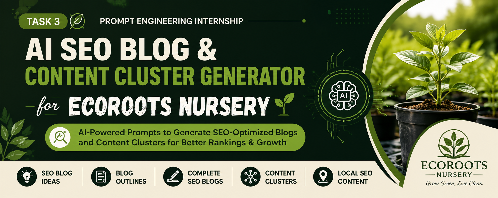

# AI SEO Blog & Content Cluster Generator for EcoRoots Nursery

---
<p align="center">
  
</p>

---

## Project Overview
This project demonstrates how AI can be used to generate SEO-optimized blogs and content clusters for a plant nursery business.

## Business
EcoRoots Nursery

## Features
- SEO Blog Ideas Generator
- SEO Blog Outline Generator
- Complete SEO Blog Generator
- SEO Content Cluster Generator
- Local SEO Blog Generator

## Tools Used
- ChatGPT
- Microsoft Word
- GitHub
- Visual Studio Code

## Project Structure

```
Task_3_EcoRoots_Nursery/
│
├── Documentation/
│   └── EcoRoots_Nursery_Task3.docx
│
├── Screenshots/
│
└── README.md
```
---

## 👤 Author

**Name:** Mohana Krishna

**Role:** Prompt Engineering Intern

**Project:** AI SEO Blog & Content Cluster Generator for EcoRoots Nursery

**Tools Used:** ChatGPT, Microsoft Word, Visual Studio Code, GitHub
